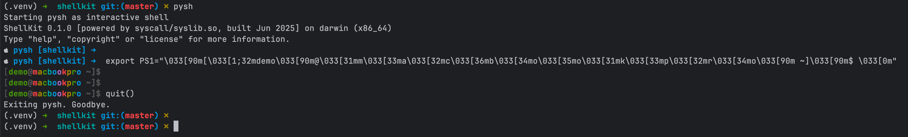

# ShellKit サンプル集

ShellKit のサンプル集へようこそ！これらの `.log` ファイルは、基本的なコマンドから高度なデバッグ機能まで、ShellKit の機能の実際の使用シナリオを紹介しています。


## 📖 サンプルの使い方

各 `.log` ファイルには完全なターミナルセッションが含まれており、以下を示しています：
- **ユーザーが入力したコマンド**（プロンプト `pysh [PATH] ➜` の後）
- **ShellKit の実際の出力**
- **一緒に操作できるインタラクティブなデモンストレーション**

コマンドをコピー＆ペーストして試してみてください！


## 📂 ディレクトリ構造

### 🟢 `basic/` - 入門ガイド
シェルの基礎を学ぶ新規ユーザーに最適：

- [getting_started.log](./basic/getting_started.log) - 初めての ShellKit セッション
- [help_system.log](./basic/help_system.log) - 内蔵ヘルプシステムの習得
- [builtin_commands.log](./basic/builtin_commands.log) - 基本コマンド（pwd、echo、env など）
- [cd_usage.log](./basic/cd_usage.log) - ディレクトリナビゲーションの基礎
- [history_usage.log](./basic/history_usage.log) - コマンド履歴とショートカット

### 🌍 `i18n/` - 多言語サポート
ShellKit の国際化機能を探索：

- [multilingual_demo.log](./i18n/multilingual_demo.log) - 英語、日本語、韓国語、中国語の切り替え
- [locale_commands.log](./i18n/locale_commands.log) - 言語環境の管理

### 🔍 `inspector/` - デバッグ & トレース
ShellKit のイントロスペクション機能を深く理解：

- [trace_echo_demo.log](./inspector/trace_echo_demo.log) - echo/printf の libc レイヤーでの呼び出しをトレース
- [debug_mode.log](./inspector/debug_mode.log) - コマンド解析と実行フロー
- [thinking_mode.log](./inspector/thinking_mode.log) - デバッグ + トレース統合分析

### 🚀 `advanced/` - パワーユーザー機能
経験豊富なユーザー向けの高度な概念：

- [command_line_options.log](./advanced/command_line_options.log) - すべてのコマンドラインフラグとオプション
- [fallback_commands.log](./advanced/fallback_commands.log) - 内蔵 vs 外部コマンドメカニズム
- [printf_formatting.log](./advanced/printf_formatting.log) - 完全な printf フォーマット指定子
- [special_variables.log](./advanced/special_variables.log) - シェル変数（$$、$?、$0）
- [tab_auto_completion.log](./advanced/tab_auto_completion.log) - インテリジェントなタブ補完


## 🎯 クイックスタートガイド

1. **シェル初心者？** [`basic/getting_started.log`](basic/getting_started.log) から始めましょう
2. **多言語マジックを見たい？** [`i18n/multilingual_demo.log`](i18n/multilingual_demo.log) をチェック
3. **内部メカニズムに興味？** [`inspector/trace_echo_demo.log`](inspector/trace_echo_demo.log) を試してみて
4. **高度な機能の準備完了？** [`advanced/printf_formatting.log`](advanced/printf_formatting.log) を探索


## 💡 学習のコツ

- **一緒に操作**：読みながらコマンドを入力する
- **実験する**：サンプルを変更して何が起こるか見る
- **ヘルプを使う**：詳細なドキュメントは `help <コマンド>` で確認
- **大文字小文字を無視**：タブ補完は大文字小文字を区別しません
- **多言語**：`export PYSH_LANG=ja` で日本語インターフェースを試してみて


## 🔧 入門サンプルコマンド

```bash
# 基本的な使用法
$ pysh
echo "こんにちは、ShellKit！"
help echo
exit

# オプション付き
$ pysh --no-banner --prompt-color green
$ pysh -c "printf 'クイックテスト: %s\n' '成功'"
$ pysh --trace-echo

# 多言語
$ export PYSH_LANG=ja && pysh
```


## 🎨 カラフルなプロンプトテーマはいかが？

```bash
$ pysh
export PS1="\033[90m[\033[1;32mdemo\033[90m@\033[31mm\033[33ma\033[32mc\033[36mb\033[34mo\033[35mo\033[31mk\033[33mp\033[32mr\033[34mo\033[90m ~]\033[90m$ \033[0m"
[demo@macbookpro ~]$ 
```



## 📚 関連ドキュメント

- **インストール**：メインの `README.md` を参照
- **コマンドリファレンス**：ShellKit 内で `help` を使用
- **開発ドキュメント**：`docs/` ディレクトリを確認
- **コントリビューション**：`CONTRIBUTING.md` を参照


## 🌟 これらのサンプルの特徴

- **リアルなターミナルセッション** - 人工的なサンプルではありません
- **段階的な複雑さ** - 初心者から専門家まで
- **クロスプラットフォーム** - macOS、Linux、Windows で動作
- **教育重視** - シェル概念とシステムコールを学習
- **多言語** - 4 言語でのサンプル（日/英/韓/中）

---

**探索の準備はできましたか？** あなたの経験レベルに合ったディレクトリを選んで始めましょう！

*覚えておいてください：ShellKit は学習のために設計されています。実験することや物事を壊すことを恐れないでください——それが最高の学習方法です！* 🚀

---

← [メインページに戻る](../README_ja.md)
