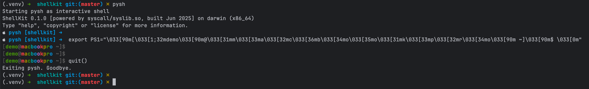

# ShellKit 예제 모음

ShellKit 예제 모음에 오신 것을 환영합니다! 이 `.log` 파일들은 기본 명령어부터 고급 디버깅 기능까지 ShellKit 기능의 실제 사용 시나리오를 보여줍니다.


## 📖 예제 사용 방법

각 `.log` 파일에는 완전한 터미널 세션이 포함되어 있으며 다음을 보여줍니다:
- **사용자가 입력한 명령어** (프롬프트 `pysh [PATH] ➜` 다음)
- **ShellKit의 실제 출력**
- **따라할 수 있는 대화형 데모**

명령어를 복사해서 붙여넣어 직접 시도해보세요!


## 📂 디렉토리 구조

### 🟢 `basic/` - 시작하기
셸 기초를 배우는 신규 사용자에게 완벽:

- [getting_started.log](./basic/getting_started.log) - 첫 번째 ShellKit 세션
- [help_system.log](./basic/help_system.log) - 내장 도움말 시스템 마스터하기
- [builtin_commands.log](./basic/builtin_commands.log) - 필수 명령어 (pwd, echo, env 등)
- [cd_usage.log](./basic/cd_usage.log) - 디렉토리 탐색 기초
- [history_usage.log](./basic/history_usage.log) - 명령어 히스토리와 단축키

### 🌍 `i18n/` - 다국어 지원
ShellKit의 국제화 기능 탐색:

- [multilingual_demo.log](./i18n/multilingual_demo.log) - 영어, 일본어, 한국어, 중국어 간 전환
- [locale_commands.log](./i18n/locale_commands.log) - 언어 환경 관리

### 🔍 `inspector/` - 디버깅 & 추적
ShellKit의 인트로스펙션 기능 깊이 이해:

- [trace_echo_demo.log](./inspector/trace_echo_demo.log) - libc 레이어를 통한 echo/printf 추적
- [debug_mode.log](./inspector/debug_mode.log) - 명령어 파싱 및 실행 흐름
- [thinking_mode.log](./inspector/thinking_mode.log) - 디버그 + 추적 통합 분석

### 🚀 `advanced/` - 파워 유저 기능
경험 많은 사용자를 위한 고급 개념:

- [command_line_options.log](./advanced/command_line_options.log) - 모든 명령줄 플래그와 옵션
- [fallback_commands.log](./advanced/fallback_commands.log) - 내장 vs 외부 명령어 메커니즘
- [printf_formatting.log](./advanced/printf_formatting.log) - 완전한 printf 형식 지정자
- [special_variables.log](./advanced/special_variables.log) - 셸 변수 ($$, $?, $0)
- [tab_auto_completion.log](./advanced/tab_auto_completion.log) - 지능형 탭 완성


## 🎯 빠른 시작 가이드

1. **셸 초보자?** [`basic/getting_started.log`](basic/getting_started.log)부터 시작하세요
2. **다국어 마법을 보고 싶나요?** [`i18n/multilingual_demo.log`](i18n/multilingual_demo.log) 확인해보세요
3. **내부 메커니즘이 궁금하신가요?** [`inspector/trace_echo_demo.log`](inspector/trace_echo_demo.log)를 시도해보세요
4. **고급 기능 준비 완료?** [`advanced/printf_formatting.log`](advanced/printf_formatting.log) 탐색해보세요


## 💡 학습 팁

- **따라하기**: 읽으면서 명령어를 입력해보세요
- **실험하기**: 예제를 수정해서 무엇이 일어나는지 보세요
- **도움말 사용**: 자세한 문서는 `help <명령어>`로 확인하세요
- **대소문자 무시**: 탭 완성은 대소문자를 구분하지 않습니다
- **다국어**: `export PYSH_LANG=ko`로 한국어 인터페이스를 시도해보세요


## 🔧 시작용 예제 명령어

```bash
# 기본 사용법
$ pysh
echo "안녕하세요, ShellKit!"
help echo
exit

# 옵션과 함께
$ pysh --no-banner --prompt-color green
$ pysh -c "printf '빠른 테스트: %s\n' '성공'"
$ pysh --trace-echo

# 다국어
$ export PYSH_LANG=ko && pysh
```


## 🎨 화려한 프롬프트 테마는 어떠세요?

```bash
$ pysh
export PS1="\033[90m[\033[1;32mdemo\033[90m@\033[31mm\033[33ma\033[32mc\033[36mb\033[34mo\033[35mo\033[31mk\033[33mp\033[32mr\033[34mo\033[90m ~]\033[90m$ \033[0m"
[demo@macbookpro ~]$ 
```



## 📚 관련 문서

- **설치**: 메인 `README.md` 참조
- **명령어 참조**: ShellKit 내에서 `help` 사용
- **개발 문서**: `docs/` 디렉토리 확인
- **기여하기**: `CONTRIBUTING.md` 참조


## 🌟 이 예제들의 특징

- **실제 터미널 세션** - 인위적인 예제가 아닙니다
- **점진적 복잡도** - 초보자부터 전문가까지
- **크로스 플랫폼** - macOS, Linux, Windows에서 작동
- **교육 중심** - 셸 개념과 시스템 콜 학습
- **다국어** - 4개 언어 예제 (한/영/일/중)

---

**탐색할 준비가 되셨나요?** 당신의 경험 수준에 맞는 디렉토리를 선택해서 시작해보세요!

*기억하세요: ShellKit은 학습을 위해 설계되었습니다. 실험하고 뭔가를 망가뜨리는 것을 두려워하지 마세요——그것이 최고의 학습 방법입니다!* 🚀

---

← [메인 페이지로 돌아가기](../README_ko.md)
